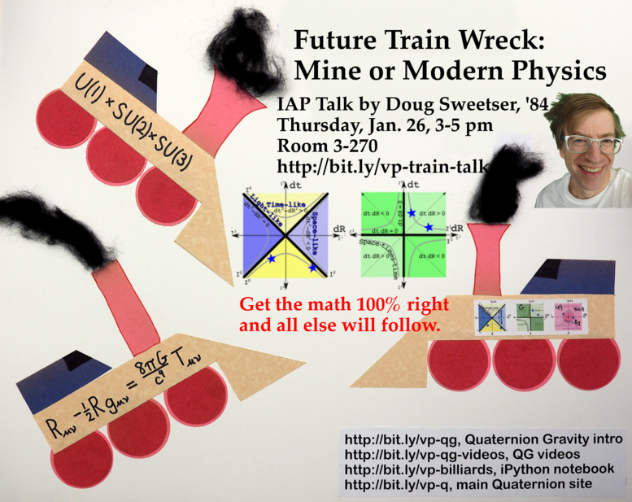

# Future Train Wreck: Mine or Modern Physics

Documents of interest for my presentation with the same title given for the
MIT Independent Activities Period (IAP). Note: only the Alumni Association
supported this effort, no one from the physics department.

## Quaternion URLs

1. Quaternion Gravity [intro](http://bit.ly/vp-qg)
1. Quaternion Gravity [videos](http://bit.ly/vp-qg-videos)
1. iPython notebook analyzing an 8 ball shot with [space-time numbers](http://bit.ly/vp-billiards)
1. Main Quaternions.com [site](http://bit.ly/vp-q) 

## PDFs

1. Maxwell source equation derivation [1 page](Maxwell_by_hand.pdf)
1. Colorful pictures of equivalence classes [10 pages](equivalence_classes_summary.pdf)
1. Quaternion gravity proposal in [2 pages](quaternion_gravity_in_2_pages.pdf)
1. Answers for Fred asked on registration page [2 pages](AnswersForFred.pdf)
1. Detailed calculation of the precession of the perihelion of Mercury [4 pages](precession.pdf)
Preliminary work to define quaternion quantum field thoery, including the
Schrodinger equation, the Klein-Gordon equation and the Dirac equation [8 pages] quaternion_quantum_field_theory.pdf

## YouTube Videos

Simple harmonic oscillators [3
minutes](https://www.youtube.com/watch?v=efYhDxm1m-g&index=1&list=PL5D_p8q0VLMGW0_-1i2UbzI-cuiIVI8Xf&t=83s)

Young's double slit experiment [7
minutes](https://www.youtube.com/watch?v=CN-wjj_phVA&index=4&list=PL5D_p8q0VLMGW0_-1i2UbzI-cuiIVI8Xf&t=28s)

Is this what quantum mechanics looks like? [7
minutes](https://www.youtube.com/watch?v=WIyTZDHuarQ&index=3&list=PL5D_p8q0VLMGW0_-1i2UbzI-cuiIVI8Xf&t=17s)

The Map of Physics [8
minutes](https://www.youtube.com/watch?v=ZihywtixUYo&index=2&list=PL5D_p8q0VLMGW0_-1i2UbzI-cuiIVI8Xf&t=12s)

